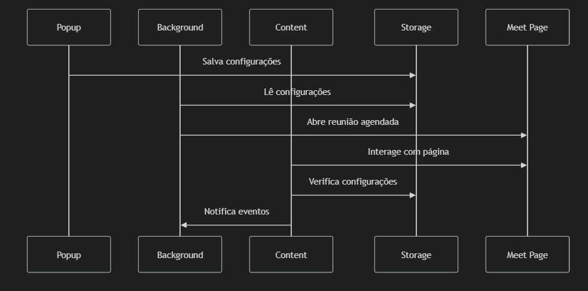

# Implementation Plan: Meet Auto Leave Extension

## 1. Project Structure


## 2. Communication Architecture



## 3. Development Plan

### Phase 1: Initial Setup
1. Create base project structure
   - manifest.json with Manifest V3 settings
   - Basic files (background.js, content.js, popup.html)
   - Configure required permissions

2. Implement storage system
   - Data schema for settings
   - Read/write functions in chrome.storage

### Phase 2: Core Features
1. **Automatic Entry**
   - Scheduler development in background.js
   - Entry button detection and click system
   - Meet page state handling

2. **Automatic Exit**
   - Implementation of three exit conditions:
     - Timer
     - Minimum number of participants
     - Peak percentage
   - Participant monitoring system
   - Exit detection and execution logic

### Phase 3: User Interface
1. **Extension Popup**
   - Responsive layout
   - Configuration forms
   - Data validation
   - Visual status feedback

2. **Integration**
   - Storage system connection
   - Background/content scripts communication

### Phase 4: Secondary Features
1. **Automatic Chat System**
   - Chat field detection
   - Automatic message sending
   - Error handling

2. **Reaction System**
   - Reaction monitoring
   - Count logic
   - Automatic sending

### Phase 5: Testing and Polish
1. **Testing**
   - Integration tests
   - Performance tests
   - Error case testing

2. **Optimization**
   - Code refactoring
   - Performance optimization
   - Documentation

## 4. Detailed File Structure

```
meet-auto-leave/
├── manifest.json
├── src/
│   ├── background/
│   │   └── background.js
│   ├── content/
│   │   └── content.js
│   ├── popup/
│   │   ├── popup.html
│   │   ├── popup.js
│   │   └── styles.css
│   └── utils/
│       ├── storage.js
│       └── constants.js
├── assets/
│   └── icons/
└── README.md
```

## 5. Technical Considerations

### Security
- Input sanitization implementation
- Meet URL validation
- Protection against injection attacks

### Performance
- Efficient monitoring using MutationObserver
- Event debouncing
- Event listener cleanup

### Maintainability
- Well-documented modular code
- Centralized constants
- Robust error handling

### Compatibility
- Manifest V3 compliant
- No external dependencies
- Meet version fallbacks